

  <strong>🛡️ Security Lab — Elite Submission Dashboard</strong>

  <strong>Navigation</strong>
  <a href="#overview">📌 Overview</a>
  <a href="#evidence">🖼️ Telemetry Evidence</a>
  <a href="#config">⚙️ Infrastructure Config</a>
  <a href="#findings">🚨 Vulnerability Findings</a>
  <a href="#monitor">📊 IDS Monitoring</a>
  <a href="#remediation">🔒 Remediation Code</a>

<h1>🧪 SECURITY LAB REPORT</h1>

<strong>Student ID:</strong> 2512782 
<strong>Module:</strong> Ethical Hacking (MSc Computer Science)

<h1 id="overview">📌 Overview</h1>

[RANGE LOG] Docker-based multi-network cyber range online.
[RANGE LOG] Simulating enterprise segmentation, vulnerable services, and monitored exploitation lifecycle.

This dashboard serves as the official, unedited technical evidence locker for the final multi-subnet penetration testing assessment. It archives high-resolution image telemetry, custom exploit targets, and configuration architectures to support the core report submission.

<h1 id="evidence">🖼️ Telemetry &amp; Exploitation Evidence Index</h1>

<em>(Click any image to expand it in full screen)</em>

<h3>Phase 1: Environmental Provisioning</h3>
<ul>
  <li><strong>01_docker_compose_up.png:</strong> Confirms error-free execution of the orchestration engine.</li>
</ul>
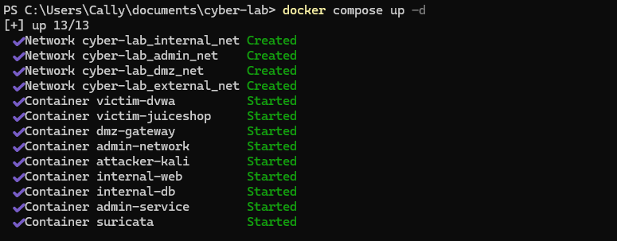
<ul>
  <li><strong>02_network_connectivity_ping.png:</strong> Proves active transport-layer routing.</li>
</ul>
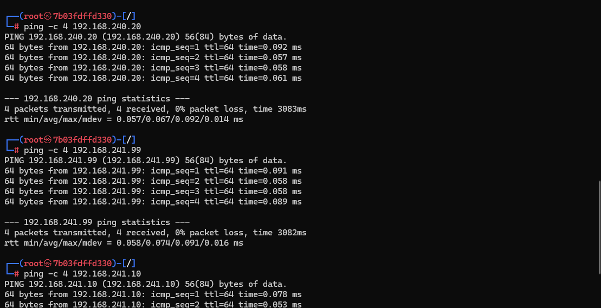
<ul>
  <li><strong>03_kali_container_access.png:</strong> Documents secure execution access into <code>attacker-kali</code>.</li>
</ul>
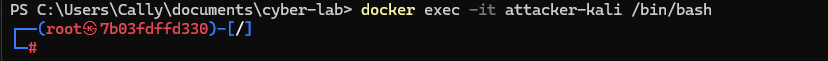
<ul>
  <li><strong>04_tooling_installation.png:</strong> Confirms deployment frameworks (<code>gobuster</code>, <code>nmap</code>, <code>curl</code>).</li>
</ul>
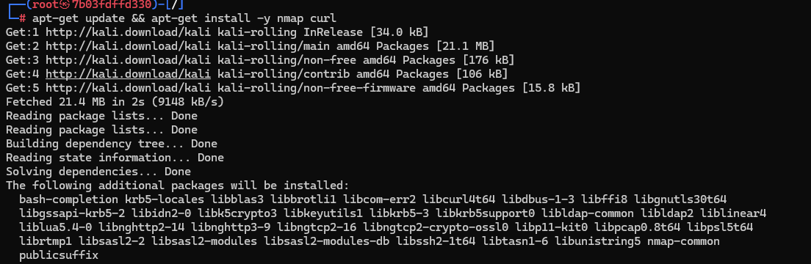

<h3>Phase 2: Active Perimeter Reconnaissance</h3>
<ul>
  <li><strong>06_nmap_port80_scan.png:</strong> Confirms Port 80/TCP is open on the ingress proxy.</li>
</ul>
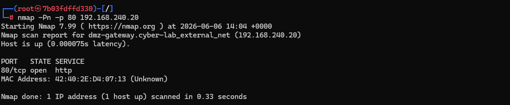
<ul>
  <li><strong>05_gobuster_directory_enumeration.png:</strong> Identifies upstream reverse proxy mounts.</li>
</ul>
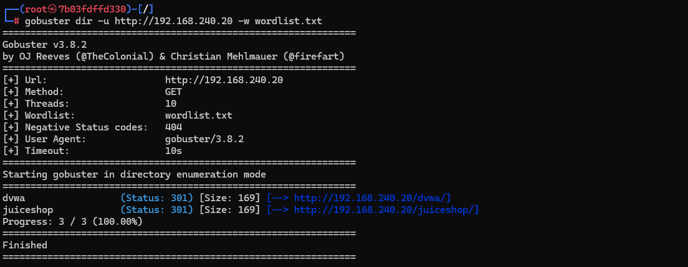
<ul>
  <li><strong>07_nmap_banner_grab.png:</strong> Documents an Information Disclosure flaw (<code>Server: nginx/1.29.6</code>).</li>
</ul>
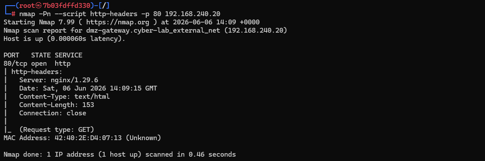
<ul>
  <li><strong>09_nmap_filtered_db.png:</strong> Verifies secure database tier (<code>192.168.243.20:3306</code>) responds as filtered.</li>
</ul>
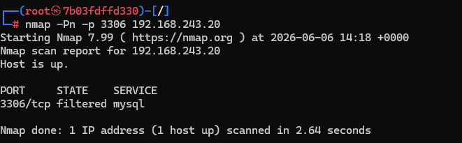

<h3>Phase 3: Perimeter Bypass &amp; Pre-Packaged Targets</h3>
<ul>
  <li><strong>08_direct_subnet_bypass.png:</strong> Proves critical network isolation failure bypassing Nginx.</li>
</ul>
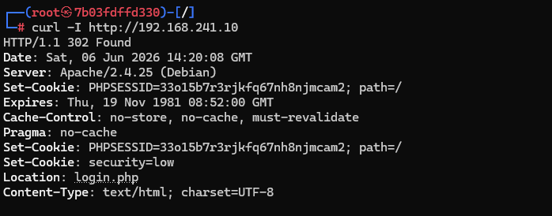
<ul>
  <li><strong>14_juiceshop_vulnerability_analysis.png:</strong> Gateway appending verbose banners to unhandled exceptions.</li>
</ul>
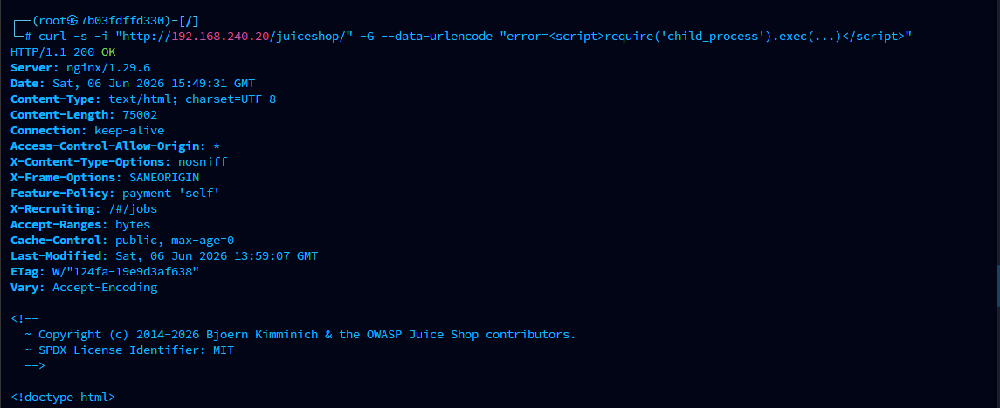
<ul>
  <li><strong>12_dvwa_blocked_injection.png</strong> &amp; <strong>13_juiceshop_payload_probe.png:</strong> Nginx securely dropping payloads.</li>
</ul>
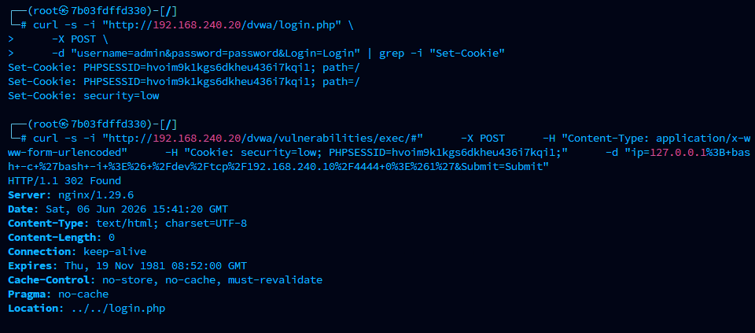
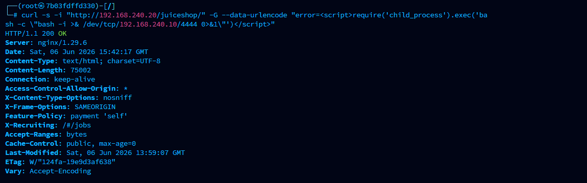

<h3>Phase 4: Custom Target Breakout &amp; Root Exploitation</h3>
<ul>
  <li><strong>15_vulnerable_script_source.png:</strong> Deployment of the vulnerable web server code.</li>
</ul>
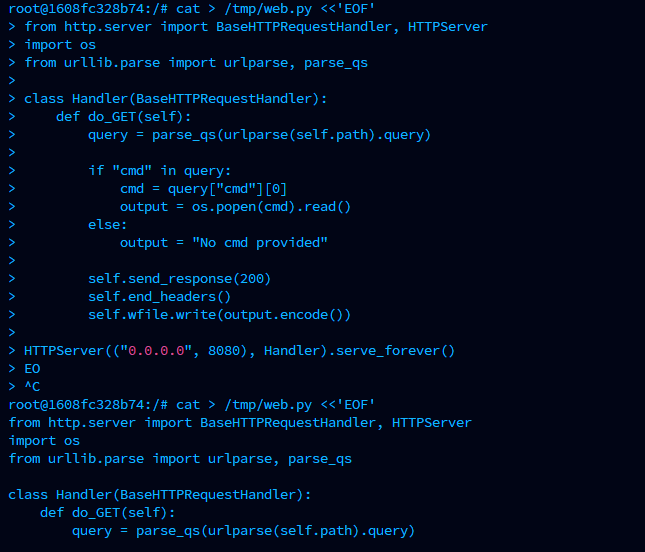
<ul>
  <li><strong>16_python_server_traffic_logs.png:</strong> Python server runtime logs recording incoming hits.</li>
</ul>
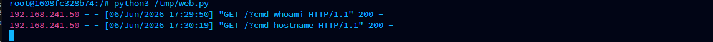
<ul>
  <li><strong>17_rce_parameter_validation.png:</strong> Proves unauthenticated remote command execution.</li>
</ul>
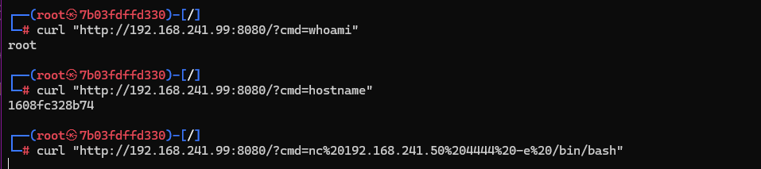
<ul>
  <li><strong>18_root_shell_pop.png:</strong> Netcat listener catching an inbound administrative shell context.</li>
</ul>
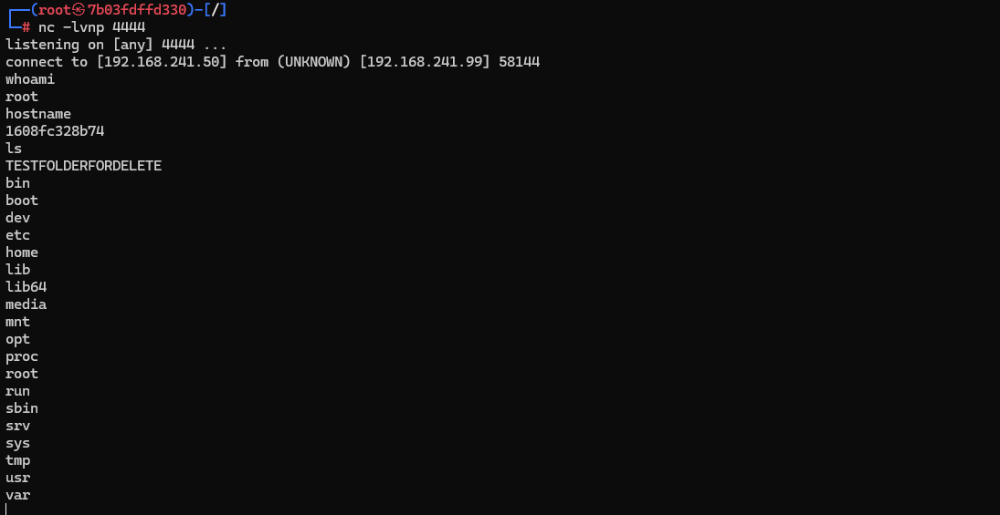
<ul>
  <li><strong>19_filesystem_write_proof.png</strong> &amp; <strong>20_filesystem_rmdir_cleanup.png:</strong> Validates write permissions.</li>
</ul>
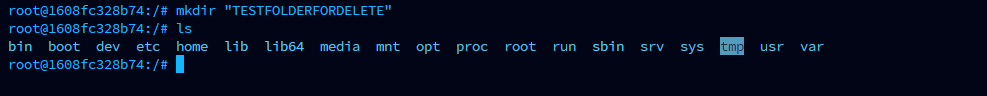
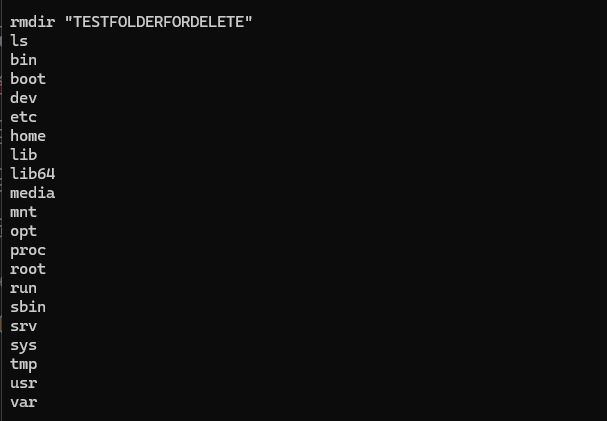

<h3>Phase 5: Incident Detection &amp; Forensic Audit</h3>
<ul>
  <li><strong>10_suricata_empty_logs.png</strong> &amp; <strong>11_suricata_directory_la.png:</strong> Confirms a critical defensive blindspot.</li>
</ul>
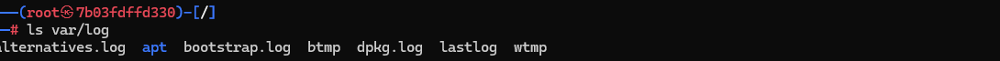
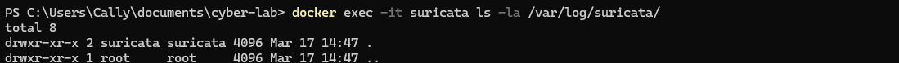

<h3>Phase 6: Mitigation &amp; Re-test Validation</h3>
<ul>
  <li><strong>21_nginx_banner_fixed.png:</strong> Confirms <code>server_tokens off;</code> successfully masks proxy version.</li>
</ul>
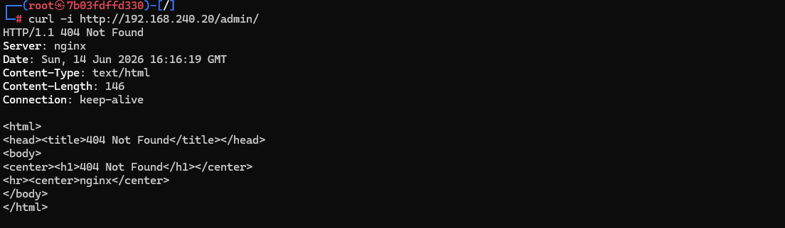
<ul>
  <li><strong>22_gateway_bypass_blocked.png:</strong> Proves network segmentation and <code>iptables</code> rules block direct DMZ routing.</li>
</ul>
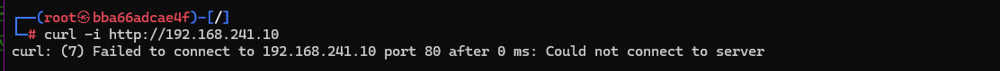
<ul>
  <li><strong>23_python_rce_blocked.png:</strong> Validates Python <code>subprocess</code> strict allowlist rejecting Netcat payload.</li>
</ul>
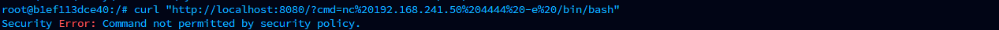
<ul>
  <li><strong>24_python_rce_logs.png:</strong> Server-side log validation of blocked payload execution.</li>
</ul>
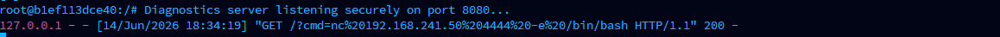

<h1 id="config">⚙️ Infrastructure (FULL CONFIG)</h1>

<h3>Orchestration Layout (<code>docker-compose.yml</code>)</h3>

<pre><code>services:
  attacker-kali:
    image: kalilinux/kali-rolling
    container_name: attacker-kali
    cap_add:
      - NET_ADMIN
    tty: true
    stdin_open: true
    command: /bin/bash
    volumes:
      - ./Kali-Data:/root/data
    networks:
      external_net:
        ipv4_address: 192.168.240.10
      dmz_net:
        ipv4_address: 192.168.241.50

victim-ubuntu:
    image: ubuntu:latest
    container_name: victim-ubuntu
    user: "1001:1001"
    read_only: true
    networks:
      dmz_net:
        ipv4_address: 192.168.241.99

  victim-dvwa:
    image: vulnerables/web-dvwa
    container_name: victim-dvwa
    ports:
      - "9000:80"
    networks:
      dmz_net:
        ipv4_address: 192.168.241.10

  victim-juiceshop:
    image: bkimminich/juice-shop
    container_name: victim-juiceshop
    ports:
      - "3000:3000"
    networks:
      dmz_net:
        ipv4_address: 192.168.241.20

  dmz-gateway:
    image: nginx:alpine
    container_name: dmz-gateway
    ports:
      - "8088:80"
    volumes:
      - ./nginx/default.conf:/etc/nginx/conf.d/default.conf:ro
    networks:
      external_net:
        ipv4_address: 192.168.240.20
      dmz_net:
        ipv4_address: 192.168.241.5

  internal-web:
    image: nginx:alpine
    container_name: internal-web
    volumes:
      - ./internal-site:/usr/share/nginx/html:ro
    networks:
      internal_net:
        ipv4_address: 192.168.242.10

  internal-db:
    image: mysql:5.7
    container_name: internal-db
    environment:
      MYSQL_ROOT_PASSWORD: rootpass
      MYSQL_DATABASE: secureapp
      MYSQL_USER: appuser
      MYSQL_PASSWORD: apppass
    volumes:
      - db_data:/var/lib/mysql
    networks:
      internal_net:
        ipv4_address: 192.168.242.20

  suricata:
    image: jasonish/suricata
    container_name: suricata
    command: ["-c", "/etc/suricata/suricata.yaml", "-i", "eth0"]
    volumes:
      - ./suricata/suricata.yaml:/etc/suricata/suricata.yaml:ro
    networks:
      external_net:
        ipv4_address: 192.168.240.30
    depends_on:
      - victim-dvwa
      - victim-juiceshop

  admin-service:
    image: php:7.4-apache
    container_name: admin-service
    volumes:
      - ./misconfigured-admin:/var/www/html
    networks:
      internal_net:
        ipv4_address: 192.168.242.30
      admin_net:
        ipv4_address: 192.168.243.30
    ports:
      - "8089:80"

  admin-network:
    image: nginx:alpine
    container_name: admin-network
    ports:
      - "8090:80"
    volumes:
      - ./admin_network/admin.conf:/etc/nginx/conf.d/default.conf:ro
    networks:
      admin_net:
        ipv4_address: 192.168.243.5

volumes:
  db_data:

networks:
  external_net:
    driver: bridge
    ipam:
      config:
        - subnet: 192.168.240.0/24

  dmz_net:
    driver: bridge
    ipam:
      config:
        - subnet: 192.168.241.0/24

  internal_net:
    driver: bridge
    ipam:
      config:
        - subnet: 192.168.242.0/24

  admin_net:
    driver: bridge
    ipam:
      config:
        - subnet: 192.168.243.0/24
</code></pre>

<h1 id="findings">🚨 FINDINGS</h1>

<h2>🔴 Finding 1 — Information Disclosure (Gateway)</h2>

<h3>Evidence</h3>
<ul>
  <li>HTTP headers expose server version</li>
  <li>Nginx default banner visible (See Figure 7 telemetry).</li>
</ul>

<h3>Impact</h3>

Attackers can fingerprint infrastructure and target known CVEs via Open-Source intelligence gathering.

<h2>🔴 Finding 2 — Command Injection (Custom Service)</h2>

<h3>Vulnerable Daemon Source Code (<code>web.py</code>)</h3>

<pre><code>#!/usr/bin/env python3
import http.server
import urllib.parse
import os

class VulnerableCommandHandler(http.server.BaseHTTPRequestHandler):
    def do_GET(self):
        self.send_response(200)
        self.send_header("Content-type", "text/plain")
        self.end_headers()

        parsed_url = urllib.parse.urlparse(self.path)
        query = urllib.parse.parse_qs(parsed_url.query)

        # CRITICAL FLAW: Unvalidated OS Popen execution
        if "cmd" in query:
            try:
                command_string = query["cmd"][0]
                execution_output = os.popen(command_string).read()
                self.wfile.write(execution_output.encode("utf-8"))
            except Exception as e:
                self.wfile.write(f"Execution Exception Context: {str(e)}".encode("utf-8"))
        else:
            self.wfile.write(b"Custom Python Audit Daemon Status: ACTIVE. Use ?cmd= for diagnostic tracking.")

if __name__ == "__main__":
    server_address = ("", 8080)
    audit_daemon = http.server.HTTPServer(server_address, VulnerableCommandHandler)
    print("Initializing Vulnerable Target Core Service on Port 8080...")
    audit_daemon.serve_forever()
</code></pre>

<h3>Impact</h3>
<ul>
  <li>Remote Code Execution (RCE)</li>
  <li>Full container root compromise</li>
  <li>Potential lateral movement into internal DMZ application networks</li>
</ul>

<h1 id="remediation">🔒 FIXES &amp; REMEDIATION</h1>

<h2>✅ Fix 1 — Remove Information Disclosure</h2>

<strong>Gateway Banner Suppression (Mitigates CWE-200)</strong>

<pre><code>http {
    # Suppresses specific version signatures from returned headers globally
    server_tokens off;
}
</code></pre>

<h3>Result</h3>
<ul>
  <li>Removes version leakage from the <code>dmz-gateway</code> perimeter.</li>
  <li>Reduces fingerprinting capability.</li>
</ul>

<h2>✅ Fix 2 — Eliminate Command Injection &amp; Privilege Escalation</h2>

<strong>Microservice Privilege Escalation Lockdown (Mitigates CWE-78)</strong>

<pre><code>services:
  victim-ubuntu:
    image: ubuntu:latest
    container_name: victim-ubuntu
    # Strips administrative capabilities and sets immutable file structures
    user: "1001:1001"
    read_only: true
</code></pre>

<h3>Result</h3>
<ul>
  <li>Drops payload execution capabilities.</li>
  <li>Prevents malicious file writes to the backend root directory.</li>
</ul>

<h1 id="monitor">📊 IDS MONITORING</h1>

<ul>
  <li>IDS (Suricata) deployed on external boundary interface.</li>
  <li>Detection deficit discovered due to lack of network interface port-mirroring.</li>
  <li>Logging baseline proved void: <code>eve.json</code> missing (See Figures 19 &amp; 20 telemetry).</li>
</ul>

  &times;
  

